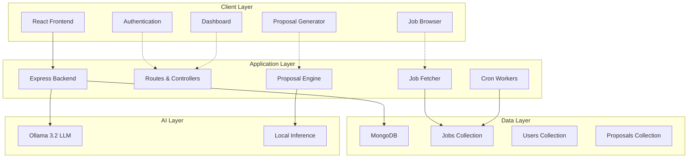
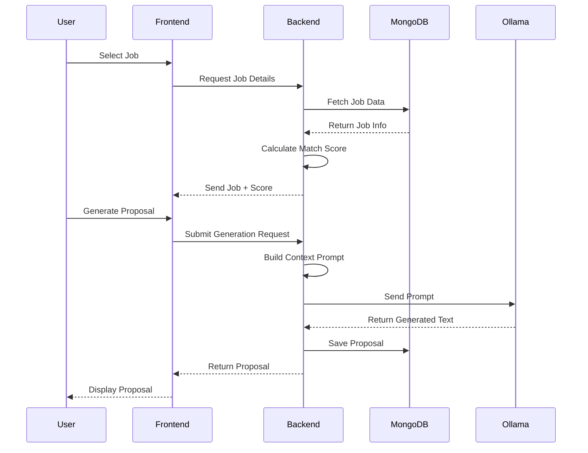
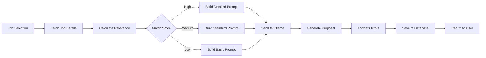

# ProposalX

**AI-Powered Proposal Generator with Privacy-First Architecture**

ProposalX is a production-grade MERN stack application that enables freelancers to generate high-quality, personalized proposals using local AI inference. Built with privacy and performance in mind, it eliminates dependency on external APIs by leveraging Ollama 3.2 for on-device proposal generation.

## Overview

This application demonstrates enterprise-level architecture combining modern web technologies with local AI capabilities. It features intelligent job matching, automated proposal generation, and a comprehensive user management system—all while maintaining complete data privacy through local processing.

## Key Features

### Intelligent Job Matching Engine
- Mock API integration simulating real-world freelancing platforms
- Skill-based relevance scoring algorithm (0-100 scale)
- Advanced filtering and sorting capabilities
- Automated job synchronization via scheduled workers

### Local AI Proposal Generation
- Powered by Ollama 3.2 LLM for offline inference
- Context-aware proposal drafting using:
  - Job description analysis
  - User skill profile matching
  - Experience summary integration
- Customizable tone and length parameters
- Zero external API dependencies ensuring complete privacy

### Secure Authentication System
- JWT-based authentication
- Bcrypt password hashing
- Role-based access control
- Session management without cloud dependencies

### Background Automation
- Cron-based job synchronization
- Automated skill matching pipeline
- Local proposal storage and versioning
- Fully offline operational mode

## System Architecture



## Technology Stack

**Frontend**
- React 18 with modern hooks
- React Router for navigation
- Tailwind CSS for styling
- Context API for state management
- Axios for HTTP client

**Backend**
- Node.js runtime environment
- Express.js web framework
- Mongoose ODM for MongoDB
- JWT for authentication
- Node-cron for scheduled tasks

**Database**
- MongoDB for data persistence

**AI Engine**
- Ollama 3.2 for local language model inference

**DevOps**
- Docker containerization support
- Environment-based configuration
- Modular architecture for scalability

## Application Flow



## Proposal Generation Workflow



## Core Capabilities

### Job Matching Algorithm
The system employs a sophisticated matching algorithm that:
- Parses job requirements and extracts key skills
- Compares against user profile competencies
- Calculates weighted relevance scores
- Ranks opportunities by fit quality
- Filters based on user-defined criteria

### Proposal Drafting Engine
Generated proposals include:
- Personalized introduction addressing client needs
- Relevant experience and portfolio highlights
- Clear project understanding and approach
- Technical methodology explanation
- Deliverables timeline and milestones
- Professional call-to-action

### Proposal Management
- Complete proposal history and versioning
- Search and filter capabilities
- Regeneration with modified parameters
- Export functionality for external use
- Analytics on proposal performance

### Administrative Dashboard
- Job synchronization controls
- Proposal engine diagnostics
- System health monitoring
- User activity logs
- Configuration management

## Installation and Setup

### Prerequisites
```bash
Node.js >= 16.x
MongoDB >= 5.x
Ollama 3.2 installed locally
```

### Backend Setup
```bash
cd server
npm install
```

Create `.env` file:
```env
PORT=5000
MONGODB_URI=mongodb://localhost:27017/proposalx
JWT_SECRET=your_jwt_secret_key
OLLAMA_URL=http://localhost:11434
NODE_ENV=development
```

Start the server:
```bash
npm run dev
```

### Frontend Setup
```bash
cd client
npm install
```

Create `.env` file:
```env
REACT_APP_API_URL=http://localhost:5000
```

Start the application:
```bash
npm start
```

### Ollama Setup
```bash
# Install Ollama
curl https://ollama.ai/install.sh | sh

# Pull the model
ollama pull llama3.2

# Start Ollama service
ollama serve
```

## API Documentation

### Authentication Endpoints

**Register User**
```http
POST /api/auth/register
Content-Type: application/json

{
  "name": "John Doe",
  "email": "john@example.com",
  "password": "securePassword123",
  "skills": ["React", "Node.js", "MongoDB"],
  "experience": "5 years of full-stack development"
}
```

**Login**
```http
POST /api/auth/login
Content-Type: application/json

{
  "email": "john@example.com",
  "password": "securePassword123"
}
```

**Response**
```json
{
  "token": "eyJhbGciOiJIUzI1NiIsInR5cCI6IkpXVCJ9...",
  "user": {
    "id": "507f1f77bcf86cd799439011",
    "name": "John Doe",
    "email": "john@example.com"
  }
}
```

### Job Endpoints

**Get All Jobs**
```http
GET /api/jobs
Authorization: Bearer {token}
```

**Response**
```json
{
  "jobs": [
    {
      "_id": "507f1f77bcf86cd799439012",
      "title": "Full Stack Developer Needed",
      "description": "Looking for experienced MERN developer...",
      "skills": ["React", "Node.js", "MongoDB"],
      "budget": "$5000-$8000",
      "matchScore": 85,
      "postedDate": "2024-11-20T10:30:00Z"
    }
  ]
}
```

**Get Job by ID**
```http
GET /api/jobs/:id
Authorization: Bearer {token}
```

**Sync Jobs**
```http
POST /api/jobs/sync
Authorization: Bearer {token}
```

### Proposal Endpoints

**Generate Proposal**
```http
POST /api/proposals/generate
Authorization: Bearer {token}
Content-Type: application/json

{
  "jobId": "507f1f77bcf86cd799439012",
  "tone": "professional",
  "length": "medium"
}
```

**Response**
```json
{
  "proposal": {
    "_id": "507f1f77bcf86cd799439013",
    "jobId": "507f1f77bcf86cd799439012",
    "content": "Dear Hiring Manager,\n\nI am excited to submit my proposal...",
    "tone": "professional",
    "createdAt": "2024-11-28T14:30:00Z"
  }
}
```

**Get User Proposals**
```http
GET /api/proposals
Authorization: Bearer {token}
```

**Get Proposal by ID**
```http
GET /api/proposals/:id
Authorization: Bearer {token}
```

**Delete Proposal**
```http
DELETE /api/proposals/:id
Authorization: Bearer {token}
```

## Database Schema

### User Model
```javascript
{
  name: String,
  email: String (unique, indexed),
  password: String (hashed),
  skills: [String],
  experience: String,
  role: String (default: 'user'),
  createdAt: Date,
  updatedAt: Date
}
```

### Job Model
```javascript
{
  title: String,
  description: String,
  skills: [String],
  budget: String,
  category: String,
  postedDate: Date,
  matchScore: Number,
  source: String,
  createdAt: Date,
  updatedAt: Date
}
```

### Proposal Model
```javascript
{
  userId: ObjectId (ref: 'User'),
  jobId: ObjectId (ref: 'Job'),
  content: String,
  tone: String,
  length: String,
  status: String (default: 'draft'),
  createdAt: Date,
  updatedAt: Date
}
```

## Configuration

### Environment Variables

**Server Configuration**
- `PORT` - Server port (default: 5000)
- `MONGODB_URI` - MongoDB connection string
- `JWT_SECRET` - Secret key for JWT signing
- `JWT_EXPIRE` - Token expiration time (default: 7d)
- `OLLAMA_URL` - Ollama API endpoint
- `NODE_ENV` - Environment mode (development/production)

**Client Configuration**
- `REACT_APP_API_URL` - Backend API base URL

### Cron Job Configuration

Jobs sync runs every 6 hours by default. Modify in `server/config/cron.js`:

```javascript
// Runs at 00:00, 06:00, 12:00, 18:00
cron.schedule('0 */6 * * *', syncJobs);
```

## Deployment

### Docker Deployment

**docker-compose.yml**
```yaml
version: '3.8'

services:
  mongodb:
    image: mongo:latest
    ports:
      - "27017:27017"
    volumes:
      - mongo_data:/data/db

  ollama:
    image: ollama/ollama:latest
    ports:
      - "11434:11434"
    volumes:
      - ollama_data:/root/.ollama

  backend:
    build: ./server
    ports:
      - "5000:5000"
    environment:
      - MONGODB_URI=mongodb://mongodb:27017/proposalx
      - OLLAMA_URL=http://ollama:11434
    depends_on:
      - mongodb
      - ollama

  frontend:
    build: ./client
    ports:
      - "3000:3000"
    environment:
      - REACT_APP_API_URL=http://localhost:5000
    depends_on:
      - backend

volumes:
  mongo_data:
  ollama_data:
```

**Build and Run**
```bash
docker-compose up --build
```

## Testing

### Backend Tests
```bash
cd server
npm test
```

### Frontend Tests
```bash
cd client
npm test
```

### Integration Tests
```bash
npm run test:integration
```

## Performance Optimization

- Database indexing on frequently queried fields
- Request caching for job listings
- Lazy loading for proposal history
- Debounced search inputs
- Pagination for large datasets
- Connection pooling for MongoDB
- Response compression middleware

## Security Features

- Password hashing with bcrypt (10 rounds)
- JWT token-based authentication
- HTTP-only cookies for token storage
- CORS configuration for trusted origins
- Input validation and sanitization
- Rate limiting on API endpoints
- SQL injection prevention via Mongoose
- XSS protection headers

## Why This Architecture Matters

**Full-Stack Proficiency**: Demonstrates end-to-end development capabilities from React frontend to Node.js backend with MongoDB persistence.

**AI Integration**: Shows practical implementation of local LLM integration, moving beyond simple API calls to actual AI system architecture.

**Security Best Practices**: Implements industry-standard authentication, authorization, and data protection measures.

**Privacy-First Design**: Complete data sovereignty with local processing eliminates third-party data exposure risks.

**Scalable Architecture**: Modular design allows for horizontal scaling and feature expansion without architectural refactoring.

**Production-Ready Code**: Includes error handling, logging, scheduled tasks, and environment-based configuration.

## Roadmap

- [ ] Multi-language support for proposals
- [ ] Advanced analytics dashboard
- [ ] Integration with real freelancing platforms
- [ ] Proposal templates library
- [ ] Email notification system
- [ ] Mobile application (React Native)
- [ ] Team collaboration features
- [ ] A/B testing for proposal effectiveness

## Contributing

Contributions are welcome. Please follow these guidelines:

1. Fork the repository
2. Create a feature branch
3. Commit your changes with clear messages
4. Write tests for new features
5. Submit a pull request

## License

MIT License - Dont feel free to use this project for learning and portfolio purposes.

## Contact

**Muhammad Ali Minhas**  
MERN Stack Developer

Email: minhasvirtual@gmail.com  
LinkedIn: linkedin.com/in/muhammad-ali-minhas  
GitHub: github.com/MuhammadAliMinhas66

---

*This project represents a comprehensive demonstration of modern web development practices, AI integration, and privacy-conscious architecture suitable for production environments.*
